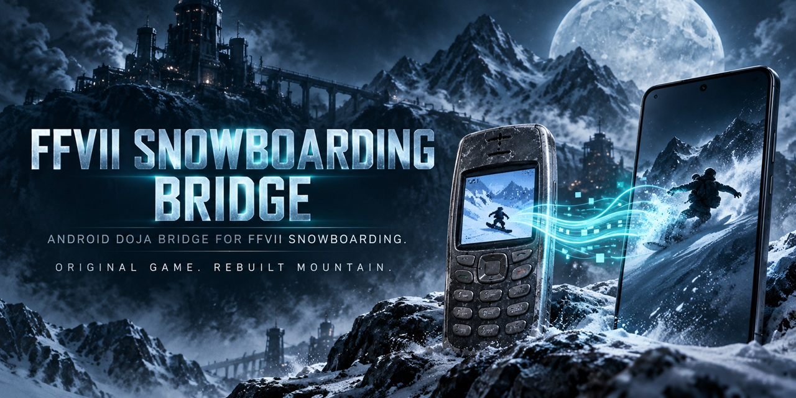

# FFVII Snowboarding Bridge



FFVII Snowboarding Bridge is an independent Android compatibility bridge for running a user's own compatible copy of the preserved **Final Fantasy VII Snowboarding** DoJa mobile game on modern Android hardware.

Current public baseline: **v0.1.2**  
Package: `com.wakka.ffviisnowboardingbridge`

## Current status

v0.1.2 has been device-tested on a **Samsung Galaxy S25 Ultra / Android 16** with working local game-data import, 3D gameplay, music/audio, the original phone keypad, and the purpose-built two-handed custom control layout.

This repository contains the bridge/runtime source and build-support material only. **No Final Fantasy VII Snowboarding game files are included.**

## Why Snowboarding Bridge exists

Final Fantasy VII Snowboarding is exactly the kind of strange little mobile release I like seeing preserved: the game still exists, but actually playing the original DoJa build on a modern phone is another problem entirely.

Snowboarding Bridge is my attempt to bridge that last gap. Give the app your own compatible game data, let the local Payload Builder prepare it, import it on Android, and play.

The goal is not to replace the preservation work that came before this project or to redistribute Square Enix's game. The goal is simply to make the preserved game practical to run on modern Android hardware.

## What works

- Original 240×240 DoJa game presentation
- 3D Snowboarding gameplay
- MLD music restored through locally generated Android MIDI mirrors
- Full original phone keypad
- Two-handed custom touch controls
- Pause/resume bridge behavior
- Runtime diagnostics and report export
- Offline play after local game-data import

## Quick start

1. Open the **Releases** section and download `FFVII_Snowboarding_Bridge_v0.1.2.apk`.
2. Install the APK on your Android device.
3. Download and extract `FFVII_Snowboarding_Payload_Builder_v0.1.0.zip` from the same release.
4. Run `RUN-PAYLOAD-BUILDER-WINDOWS.bat` on your computer.
5. Give it your compatible Snowboarding JAR and SP files.
6. The builder creates `FFVII_Snowboarding_Data_for_Bridge_v0.1.2.zip` locally.
7. Open FFVII Snowboarding Bridge and tap **IMPORT GAME DATA**.
8. Select the generated ZIP.
9. After the app reports the payload as imported and verified, tap **HIT THE SLOPES**.

Nothing is uploaded by the Payload Builder or importer.

## Compatible game-data inputs

The current Payload Builder expects the supported pair:

- `game-offline-english.jar`
- matching `game-offline-english.sp`

The builder verifies both files before generating anything. The original game files are not included in this repository or in the release APK.

## What the Payload Builder does

Everything happens locally on the user's computer. The builder:

- verifies the supplied JAR and SP by SHA-256;
- creates `game.dex` with Android D8;
- extracts the three original MLD tracks and generates Android-playable MIDI mirrors;
- creates lossless PNG compatibility mirrors for four legacy 8-bit BMP screens;
- packages the required files into `FFVII_Snowboarding_Data_for_Bridge_v0.1.2.zip`.

The Android app independently verifies all **13 expected payload files** by exact size and SHA-256 before activating them.

## Controls

The original full phone keypad is preserved and can be used directly.

The custom page keeps the original digital controls but spreads them into a more comfortable two-handed layout:

```text
EDGE LEFT        KICK        EDGE RIGHT
TURN LEFT        JUMP        TURN RIGHT
                 BRAKE

Retry                              Menu
```

During menus, the large outer/center controls become **Left / Up / OK / Down / Right**.

## Important boundaries

Do not commit or upload:

- original game JAR/JAM/SP files;
- generated `game.dex` or generated game audio;
- `FFVII_Snowboarding_Data_for_Bridge_*.zip` private payloads;
- signing keystores, signing passwords, or identity files;
- private test recordings/reports unless deliberately reviewed for publication.

The included `.gitignore` blocks the common forms of these files, but every public release should still be checked manually.

The public APK and source do **not** contain the original game payload. After a successful import, the verified JAR/resources and DEX are read from Android app-private storage.

## Repository layout

- `shared/` — reusable Android/DoJa bridge foundation
- `profiles/snowboard/` — Snowboarding-specific bridge profile and custom controls
- `runtime/snowboard/` — Snowboarding runtime compatibility layer
- `app/` — Android launcher/importer application
- `payload-builder/` — local game-data preparation tool
- `tests/` — behavioral regression checks
- `tools/` — bridge build and release-boundary verification
- `verification/` — selected public verification records
- `docs/` — release/support notes

## Building the bridge APK

Requirements:

- Python 3
- Java 17+
- Android API 35 `android.jar`
- Android Build-Tools 35.0.0

Set:

```text
ANDROID_JAR=<path to platforms/android-35/android.jar>
ANDROID_BUILD_TOOLS=<path to build-tools/35.0.0>
```

Then run:

```text
python3 tools/build.py
python3 tools/check.py
```

A public-source build creates its own local signing identity when one is not present. The canonical release signing identity is intentionally not included in this repository.

## Verification

`tools/check.py` includes the behavioral control checks and public-release boundary checks. The public boundary specifically guards against accidentally packaging original game data, original game classes, or generated game audio into the APK.

Release downloads can be checked against the published SHA-256 checksum file.

## Scope and affiliation

FFVII Snowboarding Bridge is an unofficial preservation/compatibility project. It is not affiliated with or endorsed by Square Enix or NTT DOCOMO. Final Fantasy VII and related game content belong to their respective rights holders.

No repository-wide license has been selected yet.
